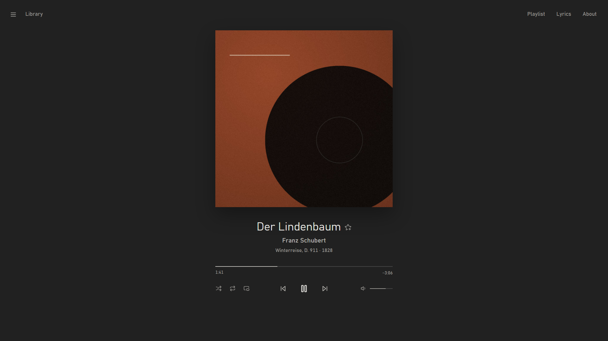
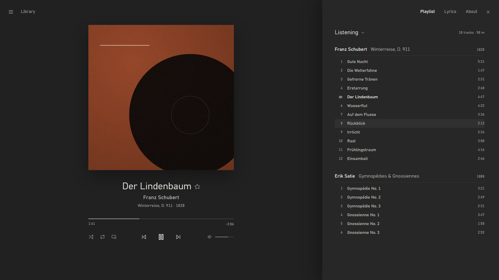
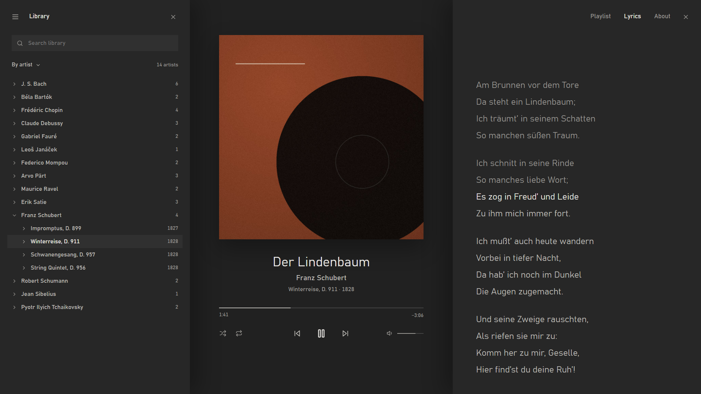
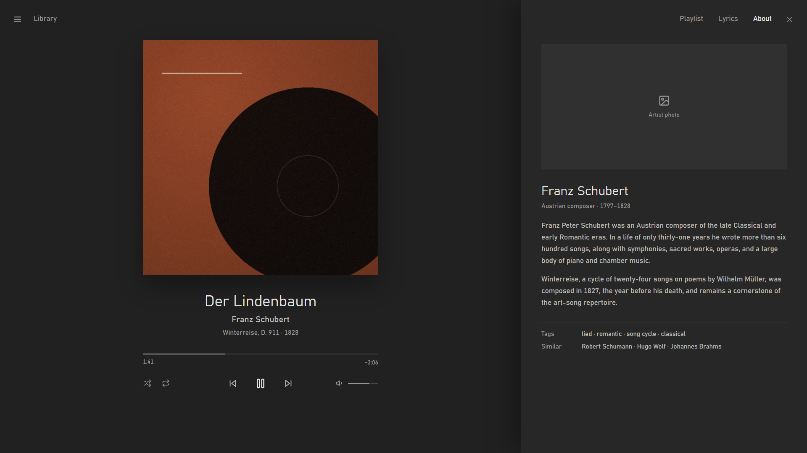

# Plinth

A quiet, soft-grey theme for [foobar2000](https://www.foobar2000.org) built around the album art.



One centred column (album art, title, artist, album · year, a hairline seek bar, transport) on a flat
`#212121` ground. Everything else lives in drawers that slide over the room:

- **Library** (left): WilB's Library Tree, restyled.
- **Playlist / Lyrics / About** (right, one at a time): a custom grouped playlist, the OpenLyrics panel,
  and WilB's Biography.

Both drawers can be open at once; the art column recentres in the space left. Type is Bahnschrift
(ships with Windows), icons are [Lucide](https://lucide.dev), and the only colour on screen is the album
art.

| Playlist | Library + Lyrics | About |
|---|---|---|
|  |  |  |

<sub>Screenshots are rendered from the design mock-up Plinth was built from, with public-domain music
(Schubert's *Winterreise*). In foobar2000 the Library and About drawers are WilB's panels restyled to
match, so they differ in detail; About shows the artist's photo where the mock-up has a placeholder.</sub>

## Requirements

- Windows 10 or 11 (for the Bahnschrift font)
- [foobar2000](https://www.foobar2000.org/download) v2, **64-bit** (tested with 2.25.7)

Components (Preferences › Components):

| Component | Tested with | Download |
|---|---|---|
| Columns UI (`foo_ui_columns`) | 3.7.0 | [foobar2000.org](https://www.foobar2000.org/components/view/foo_ui_columns) |
| JSplitter (`foo_uie_jsplitter`) | 4.2.2, 4.3.1 | [GitHub](https://github.com/dima-lur/jsplitter/releases) |
| Spider Monkey Panel x64 (`foo_spider_monkey_panel`) | 1.7.26.1.2, 1.7.26.5.1 | [GitHub](https://github.com/dima-lur/spider-monkey-panel-x64/releases) |
| OpenLyrics (`foo_openlyrics`) | 1.12, 1.13 | [GitHub](https://github.com/jacquesh/foo_openlyrics/releases) |

Spider Monkey Panel packages by WilB:

| Package | Tested with | Download |
|---|---|---|
| Library Tree | 2.4.0 | [GitHub](https://github.com/Wil-B/Library-Tree/releases) |
| Biography | 1.4.2 | [GitHub](https://github.com/Wil-B/Biography/releases) |

JSplitter 4.3 or later is needed to switch to the miniplayer from a maximized window.

The Lucide icon font is included here as `fonts/lucide.ttf`.

## Install

Download [`Plinth.fcl` and `lucide.ttf`](https://github.com/CMON1975/foobar2000-plinth/releases/latest)
from the latest release, or clone / download this repository.

1. **Components.** Preferences › Components › **Install…**, add each `.fb2k-component` above, click OK
   and let foobar2000 restart. If it asks which user interface to use, pick **Columns UI** (otherwise:
   Preferences › Display › User interface module).
2. **Packages.** Close foobar2000 and extract each package zip into Spider Monkey Panel's `packages`
   folder, in a folder named after the package ID. In PowerShell, from the folder holding the zips:

   ```powershell
   $packages = "$env:APPDATA\foobar2000-v2\foo_spider_monkey_panel\packages"
   Expand-Archive Library-Tree-v2.4.0.zip "$packages\{E85C9EF0-778B-46DD-AF20-F4BE831360DD}"
   Expand-Archive Biography-v1.4.2.zip "$packages\{BA9557CE-7B4B-4E0E-9373-99F511E81252}"
   ```

   For a portable install, use `<foobar2000 folder>\profile\foo_spider_monkey_panel\packages`. (Importing
   them through a Spider Monkey Panel's package manager, as their READMEs describe, works too.)
3. **Font.** Right-click `lucide.ttf` › **Install**.
4. **Layout.** Start foobar2000. Optional backup first: Preferences › Display › Columns UI ›
   **Export configuration…**. Then **Import configuration…** → `Plinth.fcl`, leaving all sections
   ticked. This replaces the layout (all presets), turns on dark mode with Plinth's colours and hides the
   status bar. If a menu bar or toolbar is showing, untick *Show toolbars* under Columns UI › Main
   window; the ☰ button has the full menu.

   Library Tree and Biography each show their licence once, the first time they load; close the
   popups.
5. **Library.** If you haven't already: Preferences › Media Library › **Add…** your music folders, so the
   Library drawer has something to show.
6. **Lyrics look.** OpenLyrics keeps its settings outside the layout, so set them once:
   - Preferences › Tools › OpenLyrics › **Display**: custom font *Bahnschrift Light*, 18 pt; custom main
     text colour `#BDBBB6`; custom highlight colour `#E8E6E2`; past text colour *Custom* `#989692`;
     text alignment *Left*.
   - Display › **Background**: fill *Solid colour* `#272727`, image *None*.

To go back to your previous look, import the configuration you exported in step 4.

## Use

- **☰**: the whole foobar2000 menu (File, Edit, View, Playback, Library, Help) and *Reload theme*.
- **Library**, **Playlist**, **Lyrics**, **About**: open a drawer; click again or **×** to close.
  Which drawers are open is remembered.
- Centre: click or drag the seek line; drag the volume line or scroll over it; click the speaker to
  mute. Shuffle toggles shuffle (tracks); repeat cycles playlist → track → off. Right-click the track
  info for the track's context menu. When stopped, it shows the focused playlist track.
- **Miniplayer** (the picture-in-picture button after repeat): shrinks the window to a 459×139 strip
  with the art on the left and title, artist, album, seek line and controls on the right. It has no
  title bar and stays on top of other windows; drag it by the art or text. The same button, lit, brings
  back the full window where it was, with your previous always-on-top setting. The strip remembers
  where you leave it, and foobar2000 reopens in whichever mode it closed in. From a maximized window
  it un-maximizes first and maximizes again on the way back (JSplitter 4.3+; with older versions,
  un-maximize the window yourself before switching).
- Playlist drawer: click the playlist name to switch, create, rename or delete playlists. Click,
  Ctrl/Shift-click and arrow keys select; click an album heading to select the album; double-click or
  Enter plays; Delete removes; Ctrl+A selects all; drag to reorder; drop files or library items in.
  Right-click for the usual playlist context menu.

## Icons (optional)

`icons/` has Lucide's boom-box glyph for foobar2000's tray and taskbar, in Plinth's bone colour:

- **Tray:** `boombox-tray.ico`. Preferences › Display › Columns UI, *System tray* settings › tick
  **Use custom icon** › **Select icon…**.
- **Taskbar:** `boombox-taskbar.ico`, or `boombox-tile.ico` (the glyph on a grey tile) if your taskbar
  is light. With foobar2000 pinned to the taskbar, right-click its button › right-click *foobar2000* ›
  **Properties** › **Change Icon…**. Restart Explorer (Task Manager › Windows Explorer › Restart) to
  see it. Unpinning and re-pinning brings back the default icon. The title bar and Alt+Tab keep the
  default icon, which is built into `foobar2000.exe`.

## Known issues

- **Crash on exit** (crash report shows `js::RunJobs` in `mozjs-102`): a Spider Monkey Panel bug
  ([dima-lur/spider-monkey-panel-x64#3](https://github.com/dima-lur/spider-monkey-panel-x64/issues/3))
  set off by the Biography panel's AllMusic downloads. Your settings are saved first, so nothing is
  lost, but you get a crash dialog and a "terminated abnormally" prompt at the next start. Until it's
  fixed, turn AllMusic off: right-click the About drawer › **Options…** and untick the AllMusic
  biography and review auto-downloads.

## Customise

The layout is generated from the scripts in this repository, so changes go through a rebuild
(Python 3.8+, no dependencies):

```
python tools/build_plinth.py          # writes Plinth.fcl
```

Then import `Plinth.fcl` again.

- Palette and fonts: `scripts/lib/common.js`. `SHADE` picks one of three greys in `SHADES` (*deep*,
  *soft*, *light*). Library Tree and Biography take their colours from the layout file, so mirror any
  palette change in `PALETTE` in `tools/build_plinth.py`.
- For live editing, build with `--dev`. The layout then loads the scripts straight from your checkout
  instead of embedding them, so edits apply after ☰ › *Reload theme* (centre and drawer frames) or a
  foobar2000 restart (playlist drawer). A `--dev` layout only works while the checkout stays where it
  is.

## How it's built

- `scripts/plinth.js`: the root panel, a **JSplitter**. It draws the centre column and top bar,
  and moves and shows its child panels (`Library`, `Playlist`, `Lyrics`, `About`) as drawers.
- `scripts/playlist.js`: the playlist drawer (Spider Monkey Panel).
- `scripts/lib/common.js`: palette, fonts, Lucide codepoints, drawing helpers.
- `tools/make_icons.py`: renders `icons/*.ico` from `fonts/lucide.ttf` (needs Pillow).
- `tools/build_plinth.py` and `tools/fcl.py`: write `Plinth.fcl` directly: the layout, the child panels
  with their scripts or packages and Library Tree / Biography settings, colours, and misc layout.
  `docs/fcl-format.md` documents the file format, including JSplitter's undocumented child table.
  `build_plinth.py --debug-dir DIR` makes the panels write reports and PNG renders of themselves there,
  which is handy for testing a build in a throwaway portable foobar2000.

## Credits

- [Library Tree](https://github.com/Wil-B/Library-Tree) and [Biography](https://github.com/Wil-B/Biography)
  by WilB (MIT). Not bundled; the layout only presets their settings.
- [Columns UI](https://github.com/reupen/columns_ui) by reupen,
  [JSplitter](https://github.com/dima-lur/jsplitter) by LUR,
  [Spider Monkey Panel](https://github.com/TheQwertiest/foo_spider_monkey_panel) by TheQwertiest (64-bit
  build: [dima-lur/spider-monkey-panel-x64](https://github.com/dima-lur/spider-monkey-panel-x64)),
  [OpenLyrics](https://github.com/jacquesh/foo_openlyrics) by jacquesh.
- [Lucide](https://lucide.dev) icons. `fonts/lucide.ttf` is redistributed under its ISC licence
  (`fonts/LICENSE-lucide.txt`).

## License

[MIT](LICENSE).
